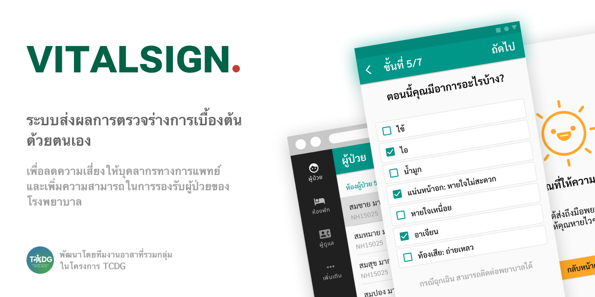
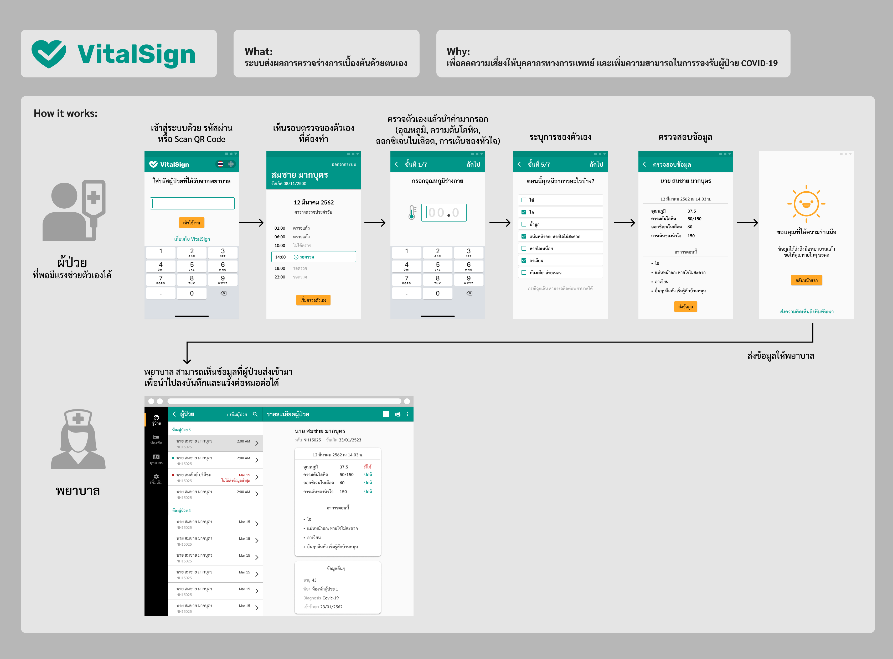
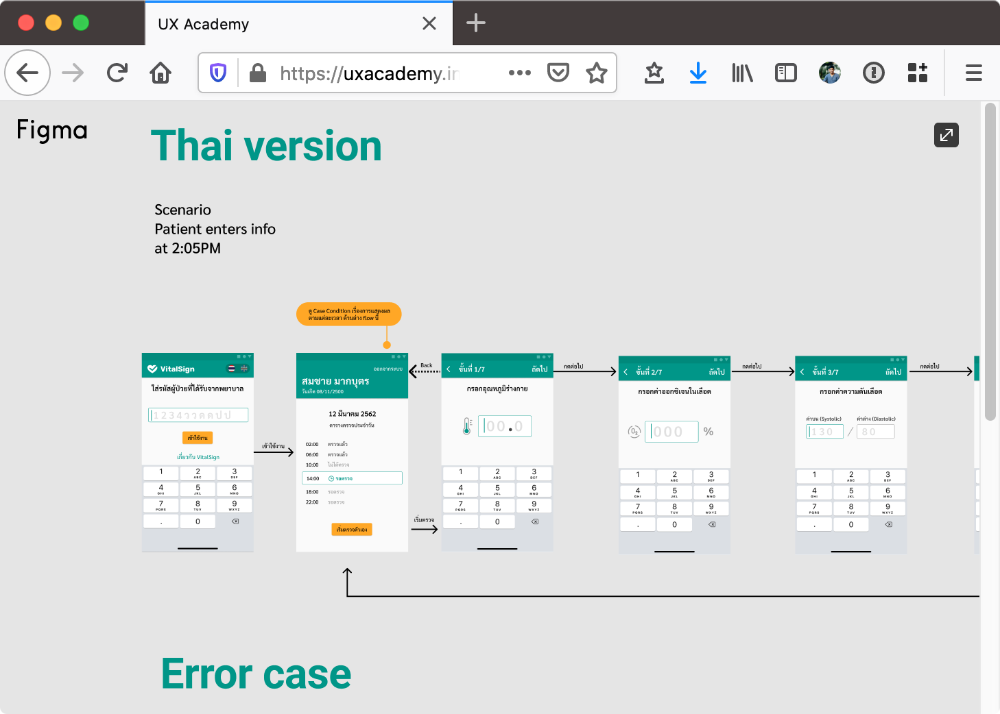

Vital sign เป็นระบบส่งผลการตรวจร่างกายเบื้องต้นด้วยตัวคนไข้เอง โครงการนี้จัดขึ้นเพื่อลดความเสี่ยงของบุคคลากรทางการแพทย์ ที่ต้องเข้าไปตรวจคนไข้อย่างใกล้ชิด นอกจากนั้นยังสามารถประหยัดเวลาในการตรวจ การบันทึกข้อมูล และลดปริมาณการใช้ชุด PEE ในการตรวจแต่ละครั้งไปในตัว
Vital Sign

## User flow

Repository นี้เป็นส่วนของผู้ใช้ สำหรับส่วนของ admin จะอยู่ที่ [visesign-admin](https://github.com/tanin5462/vitalsign-admin) โดยภาพรวมการใช้งานจะเป็นดังรูปต่อไปนี้

ทั้งนี้การตรวจวัดต่างๆ จะอยู่ภายใต้กำกับของบุคลากรทางการแพทย์ในระยะที่ปลอดภัย

## UX/UI Design

Watch live UX/UI Design on [figma](https://uxacademy.in.th/live/)

## Contributer

โครงการนี้เป็นความร่วมมือของคนหลายกลุ่ม ตั้งแต่คุณหมอจาก [สถาบันบำราศนราดูร](http://bamras.ddc.moph.go.th) กลุ่ม UX และกลุ่ม Developr ที่มาร่วมกันออกแบบ และพัฒนาระบบ เพื่อช่วยแบ่งเบาภาระของบุคคลากรทางการแพทย์ โดยไม่มีค่าใช้จ่ายในการพัฒนา

### Maintainer

[@tanin](https://github.com/berzebub), @mmasterZ

### Contributer

@art, [@apirak](https://twitter.com/apirak), @nuch, @jay, @noon, @m, @natt, @maikana 

ขอบคุณทุกท่านที่สนใจ และหากต้องเข้าร่วมสามารถสอบถามได้ที่ [@apirak](https://twitter.com/apirak)

----

This project build UI on  [Quasar Framework](https://quasar.dev/) and server site on [Google Firebase](https://firebase.google.com/)

**vitalsign** © 2020+, TCDG Group. Released under the [MIT] License. 

[MIT]: http://mit-license.org/
